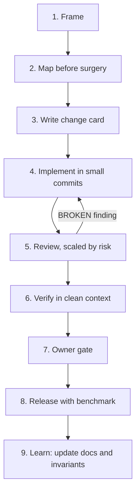
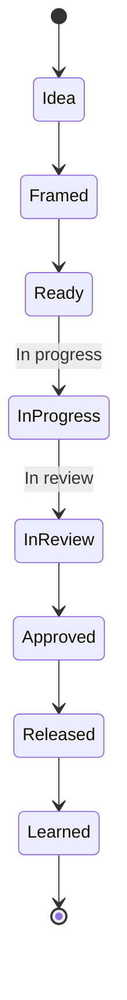

# Work Methodology

A lightweight, evidence-based methodology for shipping software changes that anyone on the team can explain, review, and trust.

## Why this methodology

Most teams don't fail from lack of talent. They fail from small, avoidable gaps:

- Changes nobody can explain six months later.
- Regressions that a quick review would have caught.
- Risk that slips through because "it looked fine."
- Context that lives only in one person's head and disappears when they're busy or gone.
- AI-generated output accepted on faith, without anyone checking it against reality.

This methodology closes those gaps with a small set of habits: write down why before you write code, size the review to the risk, verify claims against evidence, and keep a trail anyone can follow later.

## Core ideas in 60 seconds

- **Evidence or silence.** Every claim is backed by something checkable (a file, a log, a test result) or it's marked "inconclusive."
- **Protect properties, not code.** Each project ranks what matters most (e.g. data integrity, correctness, security) and uses that ranking to break ties.
- **Simplicity first.** The simplest solution that meets the invariants wins. No speculative abstractions.
- **A change card before a change.** Nine short fields explain why, what it risks, and how you'll know it worked.
- **Review scaled by risk.** Docs get a read-through; critical paths get two independent reviewers and an owner's sign-off.
- **An owner gate for shared state.** Deploys, merges, and releases always pass through a named, accountable person.
- **AI is an optional helper, not a decision-maker.** Humans own every gate.

## The workflow at a glance

See [docs/02-workflow.md](docs/02-workflow.md) for the full description of each step.

## How to use it

Quick start — adopt this in a project in 5 steps:

1. Read [docs/01-principles.md](docs/01-principles.md) and [docs/02-workflow.md](docs/02-workflow.md).
2. Copy the `templates/` folder into your project.
3. Fill in `templates/project-profile.md` (protected properties, invariants, owner gates).
4. Run one real change through the full loop as a pilot.
5. Follow the detailed steps in [docs/07-adoption.md](docs/07-adoption.md), including a two-week retro.

## Managing the work

Work moves through a simple lifecycle from idea to lesson learned, tracked in one feature document per unit of work. See [docs/05-work-management.md](docs/05-work-management.md) for the full lifecycle, checklists, and roles.

## Repository map

| File | Purpose |
|---|---|
| `docs/01-principles.md` | Evidence rules, confidence tags, protected properties, simplicity |
| `docs/02-workflow.md` | The 9-step loop, roles, and exit criteria |
| `docs/03-change-card.md` | The 9-field change card and an example |
| `docs/04-review.md` | Risk tiers, adversary roles, test doctrine |
| `docs/05-work-management.md` | Work item lifecycle, roles, cadence, owner gates |
| `docs/06-git-and-release.md` | Commit and branch conventions, benchmarking releases |
| `docs/07-adoption.md` | Step-by-step adoption plan, minimal vs. full, using AI agents |
| `templates/` | Copy-ready templates for change cards, tasks, PRs, reviews, benchmarks |
| `CONTRIBUTING.md` | How to propose changes to this methodology |

## Glossary

| Term | Meaning |
|---|---|
| Protected property | A system quality (e.g. data integrity) ranked so trade-offs have a consistent tie-breaker |
| Invariant | Something that must always stay true, with a mechanism that guards it |
| Change card | A short, structured note explaining why a change exists before it's built |
| Risk tier | The review depth assigned to a change (Exempt, Low, Medium, High) |
| Challenger | Reviewer who attacks the claims made about a change |
| Blind-spot hunter | Reviewer who looks for what nobody is watching |
| Owner gate | A point (deploy, merge, release) that requires sign-off from a named accountable person |

## FAQ

**Is this too heavy for small changes?** No. Risk tiers scale the process down: a documentation fix gets a structural read-through, not a full review. See [docs/04-review.md](docs/04-review.md).

**Do we need AI agents?** No. The methodology works entirely with humans. AI agents are optional helpers described in [docs/07-adoption.md](docs/07-adoption.md), and humans always own the decision gates.

**Do we need a specific language or stack?** No. Every example is neutral (an orders service, a mobile app). Nothing here assumes a particular tech stack.

**What if we don't have two reviewers available?** Use the emergency lane defined in your `project-profile.md` and document why, per [docs/05-work-management.md](docs/05-work-management.md).

**Can we start with just part of this?** Yes. See "Minimum viable adoption" in [docs/07-adoption.md](docs/07-adoption.md).

## License / usage

This methodology is provided for internal use. Adapt it freely to fit your team and project.
