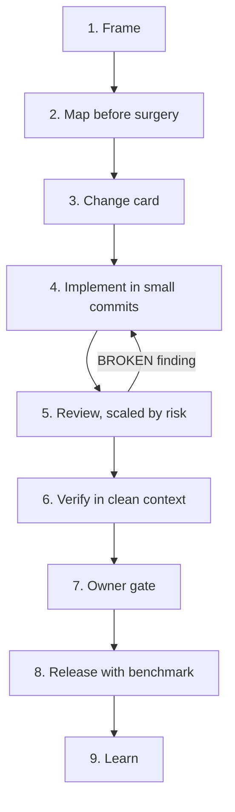
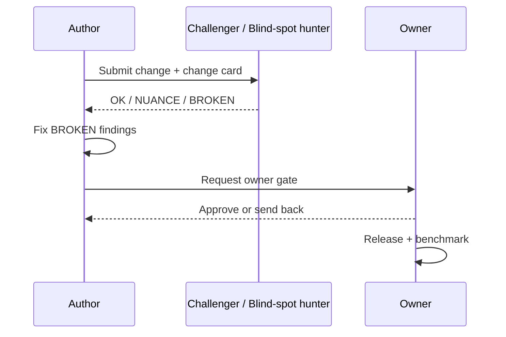

# Workflow

The loop every change goes through, from idea to lesson learned.

## The steps

| Step | Who | Input | Output | Exit criteria |
|---|---|---|---|---|
| 1. Frame | Author | A request or problem | Answers to the six questions ([docs/01-principles.md](01-principles.md)) | All six questions answered, or explicitly marked unknown |
| 2. Map before surgery | Author | The framed problem | Notes on what exists, what to reuse, likely conflicts | Author can point to the code that will change |
| 3. Change card | Author | Framing + map | Filled [change card](03-change-card.md) | Card has no empty required field |
| 4. Implement | Author | Change card | Small commits, each green on its own | Every commit passes its own checks |
| 5. Review | Challenger, Blind-spot hunter | Commits + change card | Findings (OK / NUANCE / BROKEN, CLOSED / OPEN / CONTAINED) | No open BROKEN finding |
| 6. Verify | Verifier | The change, in a clean context | Verification result | Behavior matches the change card's "how we'll know" |
| 7. Owner gate | Owner | Verified change | Merge / deploy decision | Owner explicitly approves |
| 8. Release | Owner, Author | Approved change | Release + benchmark | Benchmark recorded, compared to baseline |
| 9. Learn | Author | Release outcome | Updated docs/invariants | Lessons captured where the next person will see them |

A **BROKEN** finding at step 5 sends the change back to step 4, not around the whole loop again.

## Roles in one exchange

## Step details

**1. Frame.** Answer the six questions from [docs/01-principles.md](01-principles.md). If a real product decision is unresolved, ask and wait — don't guess.

**2. Map before surgery.** Look at what already exists before changing it. Note what can be reused, and where this change is likely to conflict with other in-flight work.

**3. Change card.** Nine required fields, described in [docs/03-change-card.md](03-change-card.md). No card, no PR.

**4. Implement in small commits.** Each commit is one idea and passes its own checks — see [docs/06-git-and-release.md](06-git-and-release.md).

**5. Review, scaled by risk.** Risk tiers, adversary roles, and rules are in [docs/04-review.md](04-review.md).

**6. Verify in clean context.** Someone other than the author (or the author, with fresh eyes and a clean environment) confirms the change does what the card claims, using the evidence rule from [docs/01-principles.md](01-principles.md).

**7. Owner gate.** A named, accountable person approves anything touching shared state: merges, deploys, releases. See [docs/05-work-management.md](05-work-management.md).

**8. Release with benchmark.** Every release records what improved, what worsened, and how it was measured, against the last shipped baseline. See [docs/06-git-and-release.md](06-git-and-release.md).

**9. Learn.** Update docs and invariants with what was learned — especially anything that surprised you.
