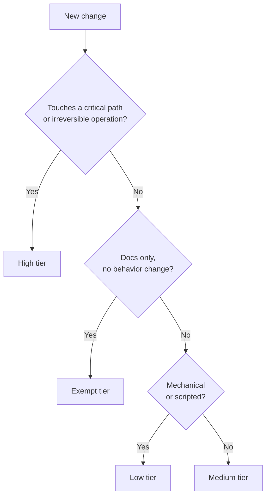

# Review

Review depth is scaled by risk, not by who's available or how the author feels about the change.

## Risk tiers

| Tier | When | Review |
|---|---|---|
| Exempt | Docs only, no behavior change | Structural readback (does it read correctly, nothing else) |
| Low | Mechanical or scripted change | Automated checks only |
| Medium | Normal feature or bug fix | One challenger, one declared lens, plus tests |
| High | Touches a critical path or an irreversible operation | Two adversaries + judge + full test battery + owner consent |

## Choosing the tier

If a critical path is touched, that outranks whatever the change card claims about scope. When in doubt, go up a tier.

## The two adversary roles

**Challenger** attacks what the change claims. Verdict per claim:

- **OK** — claim holds.
- **NUANCE** — claim mostly holds, with a caveat worth recording.
- **BROKEN** — claim does not hold.

**Blind-spot hunter** looks for what nobody is watching — the thing the change card didn't mention. Verdict:

- **CLOSED** — no blind spot found, or found and addressed.
- **OPEN** — a blind spot found, unresolved.
- **CONTAINED** — a blind spot found, but bounded and accepted with a ticket.

## Rules

- Any **BROKEN** finding is fixed before the change is pushed further.
- Any **OPEN** finding needs the owner's decision or a tracking ticket before merge.
- **OPEN beats OK** — an unresolved blind spot blocks merge even if every claim checked out, until a judge or the owner rules on it.

## Mandatory lenses

Every review, regardless of tier, checks:

1. **Simplicity.** Is this the simplest change that satisfies the invariants?
2. **Critical flow.** Can something irreversible be lost, duplicated, or orphaned? Is the process idempotent if it dies mid-way?
3. **Never worse than before.** Does this regress anything that used to work?

## Test doctrine

- A test waits for exactly what it asserts — no fixed sleeps or blind retries to paper over flakiness.
- Assert invariants, not which concurrent operation happened to win a race.
- Fixtures mirror the real shape of production data, not a simplified stand-in.
- **Negative control:** force the test to fail once, on purpose, to prove it can actually fail before trusting it to pass.

Findings are recorded with [templates/review-findings.md](../templates/review-findings.md).
