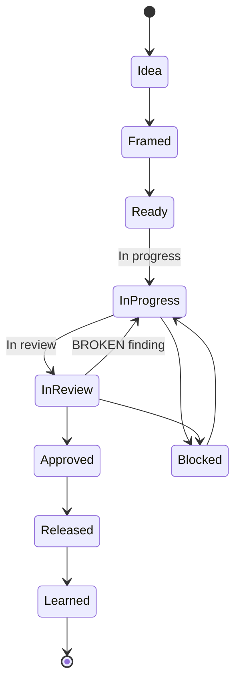

# Managing the Work

How a unit of work moves from idea to lesson learned, and who's responsible along the way.

## Work item lifecycle

## Definition of ready

- [ ] Six questions answered ([docs/01-principles.md](01-principles.md))
- [ ] Change card filled ([docs/03-change-card.md](03-change-card.md))
- [ ] Risk tier identified ([docs/04-review.md](04-review.md))
- [ ] Dependencies and conflicts mapped

## Definition of done

- [ ] All tasks checked off with observed evidence
- [ ] Review findings closed or explicitly accepted (CONTAINED)
- [ ] Verified in a clean context
- [ ] Owner gate passed
- [ ] Benchmark recorded (if released)
- [ ] Docs/invariants updated with lessons learned

## Feature task document

One file per feature, kept current as work progresses. See [templates/feature-tasks.md](../templates/feature-tasks.md). It holds:

- Objective, scope, and explicit out-of-scope
- Task checklist with stable IDs
- Acceptance criteria and checks
- Progress and evidence, updated after each task
- Next step

A box is ticked only when its outcome was actually observed — not because the code was written.

## Slicing work

- Prefer small, independently reviewable units.
- ~400 changed lines is a planning heuristic, not a hard cap — don't split a coherent change just to hit a number, and don't pad a small one either.
- Each task ends in a commit that includes its own tests and docs.

## Owner gates

An owner must explicitly approve anything touching shared state:

- Deploys
- Pull requests into shared branches
- Pushes and merges to shared branches
- Release composition
- Shared build/config files
- External tickets that commit the team
- Any other shared state

If an instruction rests on a false premise, stop and correct it before proceeding — don't execute it "as asked" and flag it after.

## Roles

| Role | Responsibility |
|---|---|
| Owner | Accountable for the gate decision; can override or delegate |
| Author | Writes the change and the change card |
| Challenger | Attacks the claims in review |
| Blind-spot hunter | Looks for what the change card didn't mention |
| Verifier | Confirms the change works, in a clean context |
| Reviewer | General term covering Challenger and Blind-spot hunter |

One person can hold several roles on a given change, but **never Author and Challenger on the same change.**

## Cadence

| Frequency | Activity |
|---|---|
| Per task | Update the feature task document, commit with tests + docs |
| Per PR | Risk-tiered review, owner gate |
| Per release | Benchmark against baseline |
| Weekly | Review open findings, blocked items, and emergency-lane usage |

## Collateral findings

A finding outside the current change's scope gets a ticket, not a drive-by fix. Fixing it inline hides it from review and expands scope without authorization.

## When the owner is unavailable

Each team defines its own **emergency lane** in `templates/project-profile.md`: who can stand in, what qualifies as an emergency, and how the real owner reviews the decision afterward.
