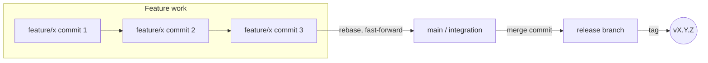

# Git and Release

Conventions for commits, branches, and releasing safely.

## Commits

- One commit, one idea. Each commit is green on its own.
- Conventional commit messages, and the message explains **why**, not just what.
- Rebase and fast-forward for feature work; merge commits are reserved for integration and release branches.
- Tag before any destructive operation, as a recovery point.
- Use `--force-with-lease`, never bare `--force`.
- `--no-verify` must be declared in the PR description if used, with a reason.

## Branch flow

## Pull requests

Every PR includes:

- A summary (use [04-templates/pull-request.md](../04-templates/pull-request.md))
- A link to its change card
- Evidence the change works
- What was explicitly **not** tested
- A rollback plan

## Release notes

Written from the release PR. Customer-facing summary up front; internal detail (implementation specifics, internal ticket links) stays out of the customer-facing section.

## No merge to a release branch without a benchmark

Every release into a release branch carries a completed [04-templates/release-benchmark.md](../04-templates/release-benchmark.md):

- What improves
- What worsens
- Why
- How it was measured
- What was **not** measured
- Baseline = the last shipped tag

## Measurement rules

- Declare one primary metric per experiment arm **before** running it.
- Change one variable at a time per arm.
- Report medians, not just averages, when comparing before/after.
- Run a negative control: confirm the measurement can show a regression, not just an improvement.
- Declare any simulation as a simulation, and account for observer effect (does measuring it change the behavior?).
- Verify the measuring instrument itself before trusting its output.
